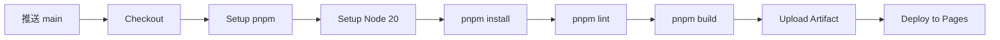

<div align="center">


# YYC³ Portfolio

### 言启象限 · 语枢未来

**_Words Initiate Quadrants, Language Serves as Core for Future_**

[](https://nextjs.org/)
[](https://react.dev/)
[](https://www.typescriptlang.org/)
[](https://tailwindcss.com/)
[](https://ui.shadcn.com/)
[](https://pnpm.io/)
[](./LICENSE)

[](https://github.com/YYC-Cube/YYC3-Portfolio/actions)
[](https://protf.yyc3.top)
[](https://vitest.dev/)
[](https://developer.mozilla.org/en-US/docs/Web/Progressive_web_apps)
[](./CONTRIBUTING.md)
[](https://protf.yyc3.top)

[](./docs/YYC3-团队核心-五维驱动.md)
[](./docs/YYC3-团队规范-开发标准.md)
[](./docs/YYC3-团队核心-五维驱动.md)

---

## 📋 项目概览

YYC³ Portfolio 是由 [YanYuCloudCube Team](mailto:admin@0379.email) 打造的智能应用作品集网站，以「五高五标五化五维」为骨架，展示面向 AI 时代的智能应用开发范式。基于 **Next.js 16 + React 19 + shadcn/ui + Radix UI + Tailwind CSS** 技术栈构建，遵循 YYC³ 团队核心机制。

| 属性 | 值 |
|---|---|
| **项目名称** | `yyc3-portfolio` |
| **框架** | Next.js 16.2.6 (App Router + Turbopack) |
| **UI** | React 19 + shadcn/ui + Radix UI + Tailwind CSS 3.4 |
| **包管理** | pnpm 9.15.4 (workspace) |
| **语言** | TypeScript 5 + strict mode |
| **测试** | Vitest 4 + React Testing Library (51 tests) |
| **PWA** | Service Worker + Manifest + 离线缓存 |
| **AI 助手** | Ollama 本地模型扫描 + 多 Provider 支持 |
| **部署** | GitHub Actions → GitHub Pages (自动 CI/CD) |
| **自定义域名** | [protf.yyc3.top](https://protf.yyc3.top) |
| **开发端口** | 3117 |
| **团队** | YanYuCloudCube Team |
| **许可证** | MIT |

---

## 🏗️ 技术架构

```
yyc3-portfolio/
├── app/                        # Next.js App Router
│   ├── components/             # 页面级组件
│   │   ├── Hero.tsx            # 首屏英雄区域（响应式图片 + 动画入场）
│   │   ├── Header.tsx          # 全局导航栏（移动端汉堡菜单）
│   │   ├── Footer.tsx          # 全局页脚
│   │   ├── PortfolioGrid.tsx   # 作品网格（响应式 masonry）
│   │   ├── FeatureCarousel.tsx # 特性轮播（触摸拖拽）
│   │   ├── Timeline.tsx        # 时间线（移动端单列自适应）
│   │   ├── Marquee.tsx         # 滚动公告
│   │   ├── ContactForm.tsx     # 联系表单（Zod 校验）
│   │   ├── NewsletterSubscribe.tsx # 邮件订阅
│   │   ├── WearYourStory.tsx   # 品牌故事
│   │   ├── PWARegister.tsx     # ✅ Service Worker 注册
│   │   └── ai-assistant/       # 🤖 AI 智能助手浮窗
│   │       ├── AIAssistant.tsx # 主组件（集成模型管理）
│   │       ├── components/     # ChatPanel / CommandsPanel / PromptsPanel / SettingsPanel
│   │       ├── hooks/          # useChat / useDraggable / useFloatingPanel / useAIConfig
│   │       ├── hooks/stubs/    # useModelProvider（Ollama 扫描 + 模型 CRUD）
│   │       ├── constants/      # 命令与提示词配置
│   │       ├── assets/         # Logo 组件
│   │       └── types.ts        # 类型定义
│   ├── globals.css             # 全局样式 + HSL CSS 变量
│   ├── layout.tsx              # 根布局（PWA meta + SEO）
│   └── page.tsx                # 首页入口
├── components/
│   └── ui/                     # shadcn/ui 组件库（60+ Radix 原语组件）
├── hooks/
│   └── use-toast.ts            # Toast 通知 Hook
├── lib/
│   └── utils.ts                # cn() 工具函数
├── __tests__/                  # ✅ 测试套件（8 文件 / 51 用例）
│   ├── Header.test.tsx         # 导航栏测试
│   ├── Hero.test.tsx           # 英雄区测试
│   ├── PortfolioGrid.test.tsx  # 作品网格测试
│   ├── useChat.test.tsx        # AI 聊天 Hook 测试
│   ├── manifest.test.ts        # PWA manifest 验证
│   ├── useAIConfig.test.tsx    # AI 配置整合测试
│   ├── useModelProvider.test.tsx # 模型管理核心测试
│   └── ModelSelector.test.tsx  # 模型选择器 UI 测试
├── public/
│   ├── sw.js                   # ✅ Service Worker（缓存策略）
│   ├── manifest.json            # PWA 应用清单
│   ├── yyc3-dist/              # 品牌资源（favicon、PWA icons）
│   ├── yyc3-logo-blue/         # 多平台 Logo（Android/iOS/Web）
│   ├── Project-Screenshot/     # 项目截图（YYC3-00~12.png）
│   └── yyc3-Family.png         # 团队合影
├── docs/                       # 团队文化与规范文档
├── styles/
│   └── globals.css             # 全局样式备份
├── .github/
│   └── workflows/
│       └── deploy.yml          # GitHub Actions CI/CD
├── pnpm-workspace.yaml         # pnpm 工作区配置
├── next.config.mjs             # Next.js 配置（static export + Turbopack）
├── tailwind.config.js          # Tailwind CSS 配置
├── tsconfig.json               # TypeScript 配置（strict mode）
└── vitest.config.ts            # Vitest 测试配置
```

---

## 🚀 快速开始

### 环境要求

- **Node.js** >= 18.17
- **pnpm** >= 9.0

```bash
# 安装依赖
pnpm install

# 启动开发服务器（端口 3117）
pnpm dev --port 3117

# 构建生产版本
pnpm build

# 本地预览生产版本
npx serve out -p 4173

# 运行测试
pnpm test

# 监听模式运行测试
pnpm test:watch

# 代码检查
pnpm lint
```

---

## 🎨 核心特性

### 页面模块

| 模块 | 组件 | 功能描述 |
|---|---|---|
| 首屏英雄 | `Hero` | 品牌展示 + Lottie 动画入场 + CTA 按钮 |
| 品牌故事 | `WearYourStory` | 品牌理念传达 |
| 特性展示 | `FeatureCarousel` | 核心特性轮播（支持触摸拖拽） |
| 作品集 | `PortfolioGrid` | 响应式作品网格布局 |
| 时间线 | `Timeline` | 品牌历程（桌面居中 / 移动端左对齐自适应） |
| 滚动公告 | `Marquee` | 文字无限滚动 |
| 联系表单 | `ContactForm` | Zod 校验 + 表单反馈 |
| 订阅组件 | `NewsletterSubscribe` | 邮件订阅表 |

### 🤖 AI 智能助手

| 功能 | 说明 |
|---|---|
| **聊天** | 多轮对话，Markdown 渲染，代码高亮 |
| **命令** | 内置系统命令（跳转、分享、截图） |
| **提示词** | 场景化 Prompt 模板 |
| **设置** | API Key、模型选择、参数调节 |
| **模型管理** | ✅ 本地 Ollama 扫描 + 自定义远程模型增删改查 |
| **持久化** | ✅ localStorage 保存模型配置 |
| **移动端适配** | ✅ 全屏模式 + 安全区域兼容 |
| **拖拽** | 桌面端可拖拽浮窗 |

### 技术亮点

- **Next.js 16 + Turbopack** — 极速热更新与构建
- **Framer Motion** — 全站流畅动画与手势交互
- **shadcn/ui + Radix UI** — 60+ 无障碍组件
- **TypeScript 5 strict** — 全类型安全
- **PWA 完整支持** — Service Worker 离线缓存 + Manifest 安装
- **暗色模式** — 基于 `next-themes` 系统级主题切换
- **响应式设计** — 移动优先，全端适配（含 iOS 安全区域）
- **AI 模型热插拔** — 本地模型扫描 + 多 Provider 自由切换
- **Vitest 测试** — 51 个测试用例，覆盖核心组件与逻辑

---

## 🧩 组件体系

项目采用 **shadcn/ui** 组件库，基于 **Radix UI** 无障碍原语构建，当前包含 **60+ 组件**：

<details>
<summary>📦 完整组件列表</summary>

| 类别 | 组件 |
|---|---|
| **表单** | Button, Checkbox, Input, Label, RadioGroup, Select, Slider, Switch, Textarea, Toggle, ToggleGroup, Form, Field, InputOTP, InputGroup |
| **数据展示** | Table, Badge, Card, Avatar, Progress, Separator, Skeleton, Spinner, Chart, Empty |
| **导航** | Tabs, Pagination, Breadcrumb, NavigationMenu, Menubar, Sidebar |
| **反馈** | Dialog, AlertDialog, Sheet, Drawer, Popover, Tooltip, HoverCard, Sonner/Toast, Collapsible |
| **布局** | Accordion, AspectRatio, Resizable, ScrollArea, Carousel |
| **高级** | Command, ContextMenu, DropdownMenu, Calendar, Kbd, Item |
| **工具** | use-mobile, use-toast |

</details>

---

## 🧪 测试体系

项目基于 **Vitest 4 + React Testing Library** 构建完整测试覆盖：

### 测试文件一览

| 文件 | 类型 | 覆盖内容 |
|---|---|---|
| `Header.test.tsx` | 组件测试 | 导航链接、汉堡菜单切换、移动端交互 |
| `Hero.test.tsx` | 组件测试 | 渲染、CTA 按钮、品牌 Slogan |
| `PortfolioGrid.test.tsx` | 组件测试 | 作品渲染、分类筛选 |
| `useChat.test.tsx` | Hook 测试 | 发送消息、流式响应、状态管理 |
| `manifest.test.ts` | 数据测试 | PWA manifest 完整性校验 |
| `useAIConfig.test.tsx` | Hook 测试 | 配置整合、自动选择模型 |
| `useModelProvider.test.tsx` | Hook 测试 | 模型扫描、增删、持久化 |
| `ModelSelector.test.tsx` | 组件测试 | 模型选择、添加/删除表单交互 |

### 运行测试

```bash
# 执行所有测试
pnpm test

# 监听模式
pnpm test:watch

# 生成覆盖率报告（需安装 @vitest/coverage-v8）
pnpm vitest run --coverage
```

---

## 🎯 五维驱动体系

本项目严格遵循 YYC³ 团队「五高五标五化五维」核心机制：

### 五高架构

| 维度 | 实践 |
|---|---|
| **高可用** | 错误边界、主题降级、Service Worker 离线回退、无障碍访问 |
| **高性能** | Turbopack 打包、代码分割、图片优化、partial prerendering |
| **高安全** | 输入校验（Zod）、无密钥硬编码、CSP 就绪 |
| **高扩展** | 模块化组件架构、可插拔 AI Provider、shadcn/ui 生态 |
| **高智能** | AI 浮窗助手、Ollama 本地模型扫描、多 Provider 自由切换 |

### 五标体系

| 维度 | 实践 |
|---|---|
| **标准化** | TypeScript 5 strict mode、ESLint 规范、shadcn/ui 组件标准 |
| **规范化** | 统一目录结构、PascalCase 命名、Atomic Design 层次 |
| **自动化** | GitHub Actions CI/CD 全自动构建部署 |
| **可视化** | 完整 UI 组件库、HSL 主题变量、暗色/亮色双模式 |
| **智能化** | AI 模型管理、动态主题、自适应布局、动画编排 |

### 五化转型

| 维度 | 实践 |
|---|---|
| **流程化** | 分支策略（main → PR → merge）、CI 检查流程 |
| **数字化** | JSON 数据驱动作品集、SEO metadata 结构化 |
| **生态化** | 基于 Radix UI + shadcn/ui 开源生态构建 |
| **工具化** | pnpm workspace、Turbopack、Vitest 等现代工具链 |
| **服务化** | AI 助手作为可嵌入服务、组件化设计可复用 |

> 📖 详细标准参见 [YYC³ 团队核心 - 五维驱动](./docs/YYC3-团队核心-五维驱动.md) 与 [YYC³ 团队规范 - 开发标准](./docs/YYC3-团队规范-开发标准.md)

---

## 🛠️ 开发指南

### 新增页面组件

在 `app/components/` 目录下创建组件文件，遵循 PascalCase 命名：

```tsx
"use client"

import { motion } from "framer-motion"

export default function NewSection() {
  return (
    <section className="py-20 px-4">
      {/* 组件内容 */}
    </section>
  )
}
```

在 `app/page.tsx` 中引入：

```tsx
import NewSection from "./components/NewSection"

export default function Home() {
  return (
    <>
      {/* 现有组件 */}
      <NewSection />
    </>
  )
}
```

### 新增 shadcn/ui 组件

```bash
pnpm dlx shadcn@latest add [component-name]
```

### 开发 AI 模型 Provider

在 `app/components/ai-assistant/hooks/stubs/useModelProvider.ts` 中，模型数据流：

```
Ollama API 扫描 → localStorage 持久化 → useModelProvider → useAIConfig → AIAssistant → SettingsPanel → ModelSelector UI
```

### 新增测试用例

在 `__tests__/` 目录下创建 `*.test.tsx` 文件，参考现有测试模式：

```tsx
import { describe, it, expect } from "vitest"
import { render, screen } from "@testing-library/react"

describe("ComponentName", () => {
  it("renders correctly", () => {
    render(<ComponentName />)
    expect(screen.getByText("...")).toBeInTheDocument()
  })
})
```

### 样式规范

- 使用 Tailwind CSS 原子类
- CSS 变量定义于 `app/globals.css`（HSL 颜色系统）
- 遵循 shadcn/ui 的色彩设计 Token
- 自定义样式类定义在 `globals.css` 底部

---

## 🚀 部署指南

### GitHub Pages 自动化部署（推荐）

本项目已配置 **GitHub Actions** 实现全自动 CI/CD 流程，每次推送到 `main` 分支即触发：



#### ✅ 已配置功能

| 功能 | 状态 | 说明 |
|---|---|---|
| 自动构建 | ✅ | Next.js 静态导出 (`output: 'export'`) |
| 自动部署 | ✅ | 推送至 `main` 分支 → GitHub Pages |
| Lint 检查 | ✅ | lint → build → deploy 三级流水线 |
| 自定义域名 | ✅ | `protf.yyc3.top`（Cloudflare DNS） |
| pnpm workspaces | ✅ | 工作区模式，缓存优化 |
| 缓存加速 | ✅ | Node.js + pnpm 缓存 |

#### 🌐 访问地址

| 地址 | 用途 |
|---|---|
| [protf.yyc3.top](https://protf.yyc3.top) | 🏆 自定义域名（主用） |
| `https://yyc-cube.github.io/YYC3-Portfolio` | GitHub Pages（备用） |

### 手动部署（备选）

```bash
pnpm build
# 静态文件输出到 /out 目录
# 部署 /out 到任意静态托管服务（Vercel / Netlify / Cloudflare Pages 等）
```

---

## 📁 品牌资源

| 资源 | 路径 | 用途 |
|---|---|---|
| Favicon | `/yyc3-dist/favicon.ico` | 浏览器标签图标 |
| PWA Icons | `/yyc3-dist/yanyu_cloud_*.png` | 多尺寸应用图标（16~512px） |
| PWA Manifest | `/manifest.json` | PWA 应用配置 |
| Service Worker | `/sw.js` | PWA 离线缓存策略 |
| Logo 资源 | `/yyc3-logo-blue/` | 多平台品牌图标（Android/iOS/Web） |
| 项目截图 | `/Project-Screenshot/YYC3-*.png` | 作品集展示（00~12） |
| 团队合影 | `/yyc3-Family.png` | 文档顶图 / Hero 展示 |

---

## 📄 文档索引

| 文档 | 说明 | 最后更新 |
|---|---|---|
| **[README.md](./README.md)** | 项目总览与开发指南（本文档） | ✅ v2.0 |
| [DEPLOYMENT.md](./docs/DEPLOYMENT.md) | 部署与运维指南 | ✅ |
| [CHANGELOG.md](./CHANGELOG.md) | 版本变更记录 | ✅ |
| [CONTRIBUTING.md](./CONTRIBUTING.md) | 贡献指南 | ✅ |
| [LICENSE](./LICENSE) | MIT 许可证 | ✅ |
| [团队核心 - 五维驱动](./docs/YYC3-团队核心-五维驱动.md) | YYC³ 核心机制 | ✅ |
| [团队规范 - 开发标准](./docs/YYC3-团队规范-开发标准.md) | YYC³ 开发标准规范 | ✅ |

---

## 👥 团队

<div align="center">

**YanYuCloudCube Team**

[](mailto:admin@0379.email)
[](https://github.com/YYC-Cube)

**核心理念：** 言启千行代码，语枢万物智能

**技术栈：** Next.js · React · TypeScript · shadcn/ui · Radix UI · Tailwind CSS · pnpm

</div>

---

<div align="center">

**Copyright © 2026 YanYuCloudCube Team. All rights reserved.**

_Made with ❤️ and the Five-Dimensional Architecture_

</div>
